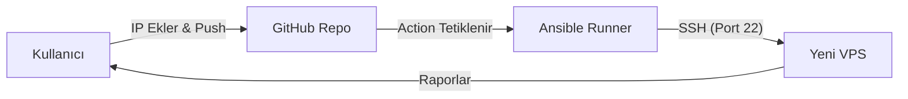

# Otomasyon Vizyonu: Server Setup as a Service

Bu rehberde anlatılan onlarca adımı (SSH, Firewall, Docker vb.) her yeni sunucuda elle yapmak hem zaman kaybıdır hem de hata riskini artırır. Hedefimiz, bu süreci "Tek Tık" haline getirmektir.

## 1. Konsept: Infrastructure as Code (IaC)

Sunucularımız "evcil hayvan" (Pet) değil, "büyükbaş hayvan" (Cattle) gibi olmalıdır. Bozulunca tamir etmekle uğraşmak yerine silip yenisini saniyeler içinde kurabilmeliyiz.

### Araçlar Savaşı: Terraform vs Ansible

Piyasada iki dev vardır. Bizim senaryomuz için hangisi uygun?

| Araç          | Görevi                   | Analoji                   | Bizim İçin Uygunluk                                                                        |
| :------------ | :----------------------- | :------------------------ | :----------------------------------------------------------------------------------------- |
| **Terraform** | Altyapı Oluşturucu       | Müteahhit (Binayı diker)  | ❌ **Düşük:** Müşterinin çok gizli `API Key`lerini ister. Güvenlik riski yüksektir.        |
| **Ansible**   | Konfigürasyon Yöneticisi | İç Mimar (Eşyaları dizer) | ✅ **Yüksek:** Sadece `IP` ve `SSH Key` yeterlidir. Cloud bağımsızdır (Her yerde çalışır). |

> [!TIP] > **Karar:** "Hizmet Olarak Kurulum" vereceksek, müşteriden en az yetkiyi isteyen **Ansible** ile ilerlemek en mantıklısıdır. Müşteri sunucusunu açar, bize IP verir, biz de gidip kurulumu yaparız.

## 2. Mimari Modeller

Gelecekte kurmayı planladığımız sistemin iki farklı versiyonu olabilir:

### Model A: GitHub Actions (Push-Based)

En maliyetsiz ve hızlı yöntemdir.

1.  **Repo:** Tüm ayarlar (Monitoring, Docker, Güvenlik) bir GitHub reposunda durur.
2.  **Tetikleyici:** Müşteri `hosts.ini` dosyasına yeni sunucu IP'sini ekleyip `git push` yapar.
3.  **Action:** GitHub Actions, Ansible'ı çalıştırır.
4.  **Sonuç:** GitHub sunucuya SSH ile bağlanır ve kurulumu tamamlar.



### Model B: Merkezi Kontrol Kulesi (SaaS - UI)

Tam ticari "SaaS" modelidir.

1.  **Web Panel:** Müşteri bizim web sitemize girer.
2.  **Form:** Sunucu IP'sini ve root şifresini (veya geçici key'i) girer.
3.  **Backend:** Bizim sunucumuz (Jenkins / Ansible Tower) kuyruğa bir iş atar.
4.  **Worker:** İşçiler sırayla sunuculara bağlanıp kurulumu yapar.

## 3. İlk Adım (MVP): Shell Script (Mevcut Durum)

Henüz Ansible'a geçmeden önce, mevcut `server-init.sh` scriptimiz "V0.1" olarak iş görmektedir.

```bash
# Otomatik kurulum scripti (Linux/Mac)
curl -O https://raw.githubusercontent.com/your-repo/handbook/main/scripts/server-init.sh
chmod +x server-init.sh
./server-init.sh
```

_(Scriptin detaylı içeriği bu sayfanın eski versiyonlarında mevcuttu, şimdi Ansible playbooklarına evriliyoruz.)_
