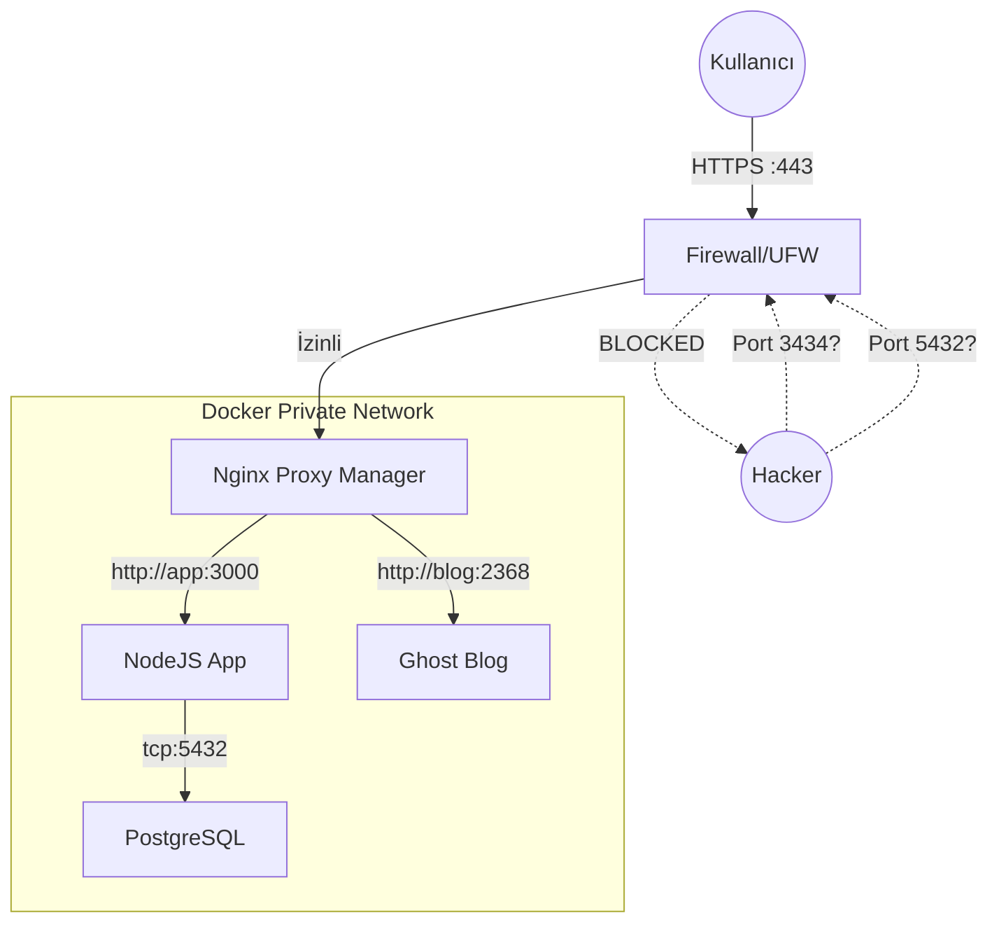

# Docker Gateway Mimarisi

Bu bölüm, güvenlik duvarını (UFW) delmeden ve portları dış dünyaya saçmadan Docker konteynerlerinin nasıl yönetileceğini anlatır.

## Sorun: "Port 3434 Açtım, Hacklendim"

Docker, ağ kurallarını yönetmek için `iptables` ile doğrudan konuşur. Siz UFW ile "her şeyi kapat" deseniz bile, `docker-compose.yml` dosyasında şu satırı yazdığınız an o port tüm dünyaya açılır:

```yaml
ports:
  - "3000:3000" # TEHLİKELİ: UFW'yi bypass eder ve tüm dünyaya açılır!
```

## Çözüm: Gateway (Kapı) Modeli

Tüm trafiği tek bir güvenli kapıdan (Port 80/443) içeri alıp, içeride dağıtma yöntemidir.

### Temel Prensipler

1.  **Tek Giriş Noktası:** Sadece **Nginx Proxy Manager (NPM)** dış dünyaya (80/443) açık olur.
2.  **Kapalı Odalar (Backend):** Veritabanları, API'ler ve diğer servisler dış dünyaya **ASLA** port açmaz (`ports` kısmı silinir).
3.  **Özel Ağ (Private Network):** NPM ve diğer servisler, kendi aralarında `docker network` üzerinden konuşur.

### Mimari Şeması



## Nasıl Uygulanır?

### 1. Dışa Kapalı Servis Tanımı

Servisinizin `docker-compose.yml` dosyasında `ports:` bölümünü **kaldırın** veya sadece localhost'a açın.

**Yanlış (Güvensiz):**

```yaml
services:
  myapp:
    image: myapp:latest
    ports:
      - "3000:3000" # 0.0.0.0:3000 -> DÜNYAYA AÇIK!
```

**Doğru (Güvenli):**

```yaml
services:
  myapp:
    image: myapp:latest
    expose:
      - "3000" # Sadece Docker ağı içinden erişilebilir
    networks:
      - frontend-network
```

### 2. Ortak Ağ (Network) Oluşturma

Tüm servislerin NPM ile konuşabilmesi için ortak bir ağa ihtiyaçları vardır.

```bash
docker network create frontend-network
```

### 3. Nginx Proxy Manager Konfigürasyonu

NPM, bu "frontend-network"e dahil olmalıdır ki diğer servisleri (ismiyle) bulabilsin.

```yaml
services:
  npm:
    image: "jc21/nginx-proxy-manager:latest"
    ports:
      - "80:80"
      - "443:443"
      - "81:81"
    networks:
      - frontend-network
```

NPM arayüzünde "Forward Hostname / IP" kısmına artık IP adresi yerine **servis adı** yazabilirsiniz:

- Hostname: `myapp`
- Port: `3000`

## Özet

1.  Port 80/443/22 haricinde **hiçbir portu** UFW'de açmayın.
2.  Docker servislerinde `ports: "8080:8080"` yerine `expose` kullanın veya `ports` kısmını tamamen silin.
3.  Tüm servisleri bir `docker network` içine koyun ve trafiği NPM üzerinden yönetin.
